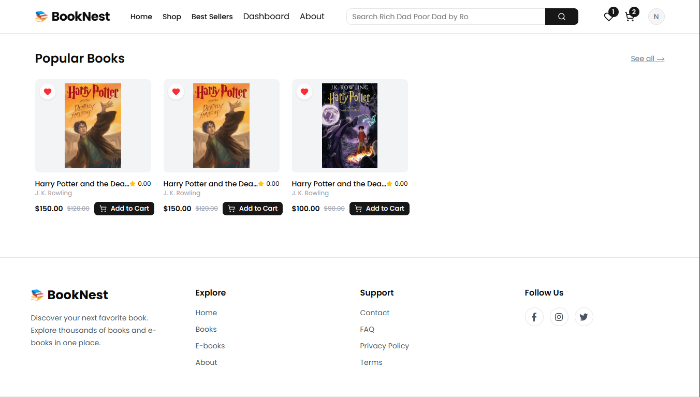
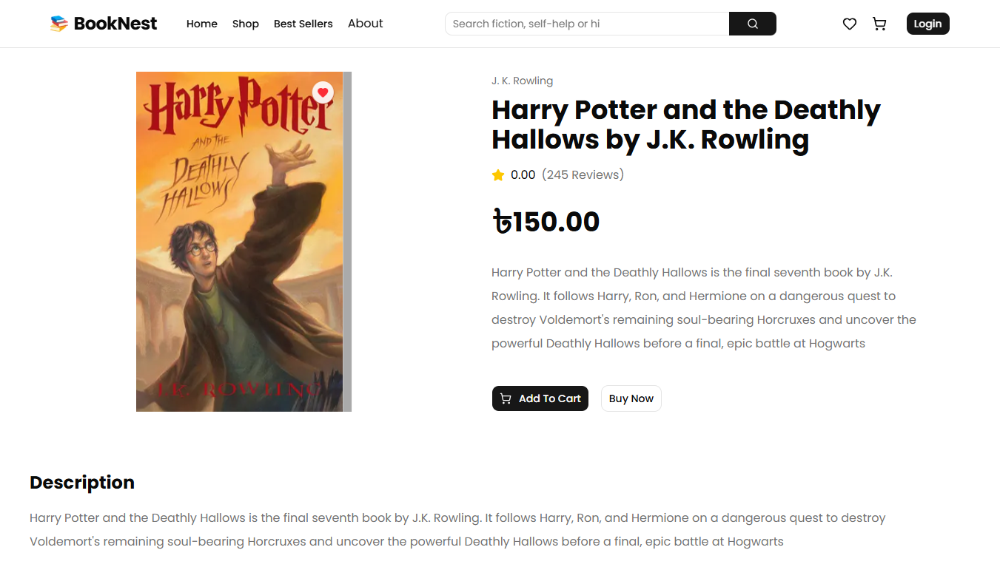
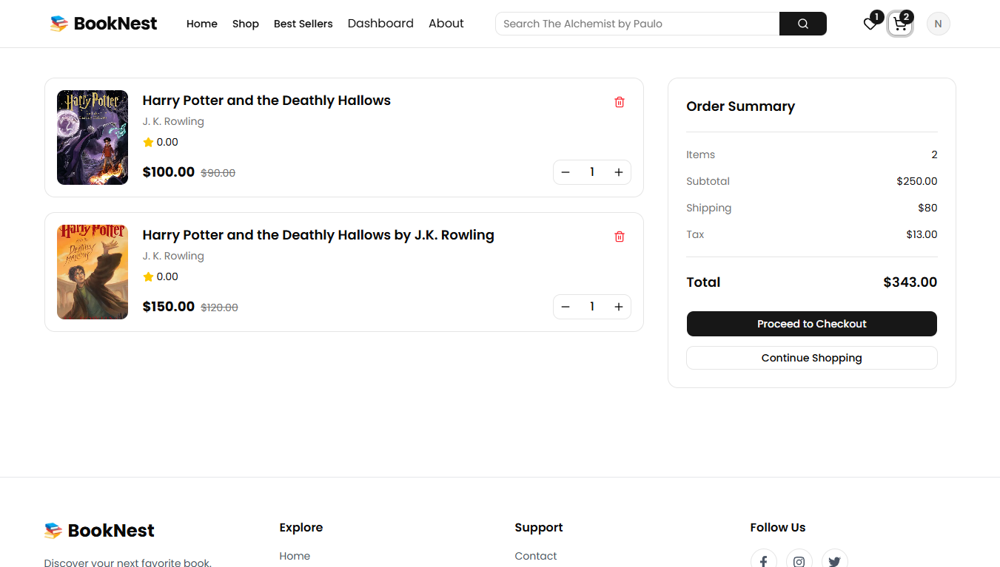
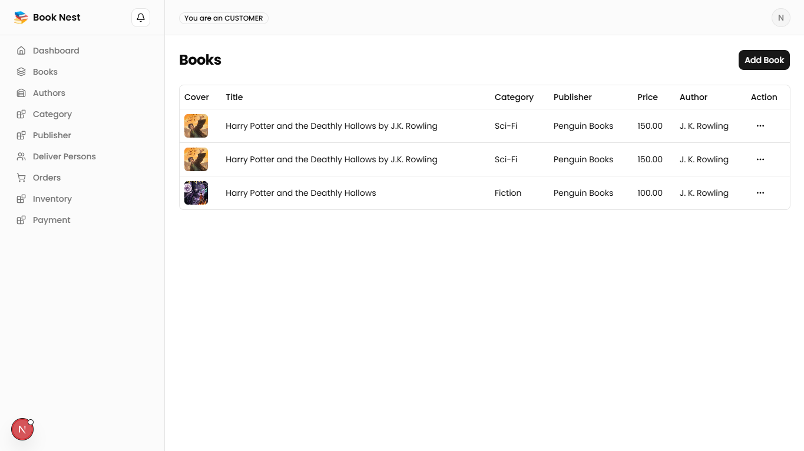

# 📚 BookNest

> A modern full-stack online bookstore built with **Next.js, TypeScript, PostgreSQL, and Drizzle ORM**.

BookNest is an e-commerce web application for buying and managing books. It includes a customer-facing storefront, authentication, shopping cart, wishlist, checkout, order management, reviews, and an admin dashboard for managing the platform.

---

## 🌐 Live Demo

🔗 **Live Website:** https://book-nest-eight-gamma.vercel.app

🔗 **GitHub Repository:** https://github.com/nishadinfo9/book-nest

---

## 📸 Screenshots

### 🏠 Home Page


### 📚 Books / Product Listing



### 📖 Book Details



### 🛒 Shopping Cart



### 📊 Admin Add Book



> **Note:** Add your screenshots inside a `screenshort` folder in the project root.

---

## ✨ Features

### 👤 User Features

* User registration and login
* Secure authentication
* Browse books by category
* Search and filter books
* Book details and related books
* Shopping cart
* Wishlist
* Product reviews and ratings
* Order placement
* Order history
* Responsive design

### 🛒 E-commerce Features

* Product/book management
* Inventory management
* Cart management
* Order management
* Order items management
* Wishlist management
* Reviews and ratings
* Stripe payment integration
* Cloudinary image management

### 🛠️ Admin Features

* Admin dashboard
* Manage books
* Manage authors
* Manage publishers
* Manage categories
* Manage inventory
* Manage orders
* Manage users
* Manage reviews
* View sales and order statistics

---

## 🧱 Tech Stack

### Frontend

| Technology         | Purpose                    |
| ------------------ | -------------------------- |
| **Next.js 16**     | Full-stack React framework |
| **React 19**       | UI development             |
| **TypeScript**     | Type safety                |
| **Tailwind CSS 4** | Styling                    |
| **shadcn/ui**      | Reusable UI components     |
| **Framer Motion**  | Animations                 |
| **Lucide React**   | Icons                      |

### Backend & Database

| Technology             | Purpose                     |
| ---------------------- | --------------------------- |
| **Next.js API Routes** | Backend/API development     |
| **PostgreSQL**         | Relational database         |
| **Drizzle ORM**        | Database queries and schema |
| **Redis / ioredis**    | Caching                     |
| **Zod**                | Data validation             |

### Authentication & Payments

| Technology      | Purpose            |
| --------------- | ------------------ |
| **NextAuth.js** | Authentication     |
| **bcryptjs**    | Password hashing   |
| **Stripe**      | Payment processing |

### State & Data Management

| Technology               | Purpose                      |
| ------------------------ | ---------------------------- |
| **Zustand**              | Client-side state management |
| **TanStack React Query** | Server state and API data    |
| **Axios**                | HTTP requests                |
| **React Hook Form**      | Form management              |

### Other Tools

* **Cloudinary** — Image upload and management
* **DND Kit** — Drag-and-drop functionality
* **Recharts** — Dashboard charts
* **ESLint** — Code quality
* **Git & GitHub** — Version control

---

## 🗄️ Database Structure

BookNest uses **PostgreSQL** with **Drizzle ORM**.

Main entities include:

```text
Users
 ├── Orders
 ├── Reviews
 ├── Wishlist
 └── Cart Items

Books
 ├── Authors
 ├── Publishers
 ├── Categories
 ├── Inventory
 ├── Reviews
 └── Order Items

Orders
 ├── Order Items
 └── Payments
```

---

## 🏗️ Project Architecture

```text
BookNest
│
├── app/
│   ├── (auth)/
│   ├── (shop)/
│   ├── admin/
│   ├── api/
│   └── ...
│
├── components/
│   ├── ui/
│   ├── books/
│   ├── cart/
│   ├── admin/
│   └── ...
│
├── db/
│   ├── schema/
│   └── ...
│
├── lib/
│   ├── auth/
│   ├── redis/
│   ├── cloudinary/
│   └── ...
│
├── public/
│
├── drizzle.config.ts
├── migrate.ts
├── package.json
└── README.md
```

> The structure above represents the main architectural areas. Adjust the folder names if your actual project structure is different.

---

## 🚀 Getting Started

### 1. Clone the repository

```bash
git clone https://github.com/nishadinfo9/book-nest.git

cd booknest
```

### 2. Install dependencies

```bash
npm install
```

### 3. Configure environment variables

Create a `.env.local` file:

```env
DATABASE_URL=
NEXT_PUBLIC_BACKEND_URL=

CLOUDINARY_CLOUD_NAME=
CLOUDINARY_API_KEY=
CLOUDINARY_API_SECRET=

NEXTAUTH_SECRET=
NEXTAUTH_URL=
GOOGLE_CLIENT_ID=
GOOGLE_CLIENT_SECRET=


STORE_ID=
SSL_API_SECRET=
```

Add the required values for your environment.

### 4. Generate database migrations

```bash
npm run db:generate
```

### 5. Run database migration

```bash
npm run db:run
```

### 6. Start the development server

```bash
npm run dev
```

Open:

```text
http://localhost:3000
```

---

## 📜 Available Scripts

| Command               | Description                  |
| --------------------- | ---------------------------- |
| `npm run dev`         | Start development server     |
| `npm run build`       | Build production application |
| `npm run start`       | Start production server      |
| `npm run lint`        | Run ESLint                   |
| `npm run db:generate` | Generate Drizzle migrations  |
| `npm run db:run`      | Run database migrations      |

---

## 🔐 Environment Variables

For security reasons, environment variables are **not included in this repository**.

You need to configure:

* PostgreSQL database
* NextAuth authentication
* Cloudinary
* SSLCOMMERZ

before running all features locally.

---

## 📱 Responsive Design

BookNest is designed to provide a consistent experience across:

* 💻 Desktop
* 📱 Mobile
* 📟 Tablet

The UI is built with **Tailwind CSS** and reusable components from **shadcn/ui**.

---

## 🎯 What I Learned

Building BookNest helped me improve my understanding of:

* Full-stack development with Next.js
* React component architecture
* TypeScript
* PostgreSQL database design
* Drizzle ORM
* REST API development
* Authentication and authorization
* Payment integration with SSLCOMMERZ
* Form validation with Zod
* State management with Zustand
* Server-state management with React Query
* Cloudinary image handling
* Responsive UI development
* Admin dashboard development
* E-commerce architecture

---

## 🔮 Future Improvements

* [ ] Advanced book recommendation system
* [ ] Advanced search with better filtering
* [ ] Email notifications
* [ ] Coupon and discount system
* [ ] More advanced analytics
* [ ] Improved product recommendation
* [ ] Automated testing
* [ ] Performance optimization

---

## 👨‍💻 Developer

**Nishad Hasan**

Frontend-focused developer with experience in **React.js, Next.js, TypeScript, REST APIs, and modern web technologies**.

### Connect With Me

* **GitHub:** https://github.com/nishadinfo9
* **Portfolio:** https://nishadhasan.vercel.app

---

## ⭐ Support

If you find this project useful or interesting, consider giving the repository a ⭐ on GitHub.

---

## 📄 License

This project is created for learning and portfolio purposes.
